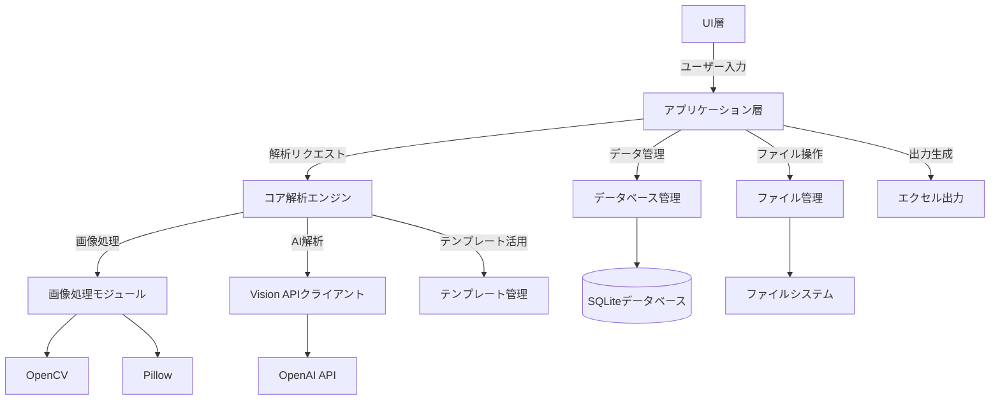
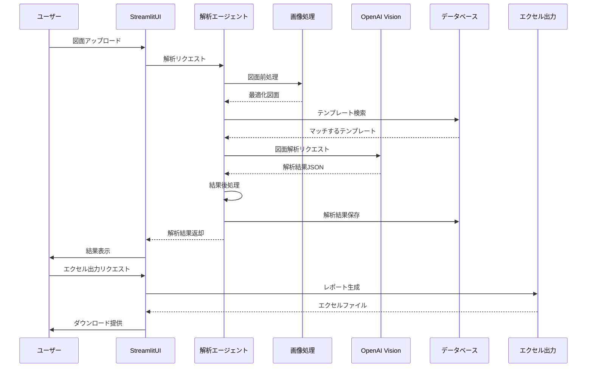
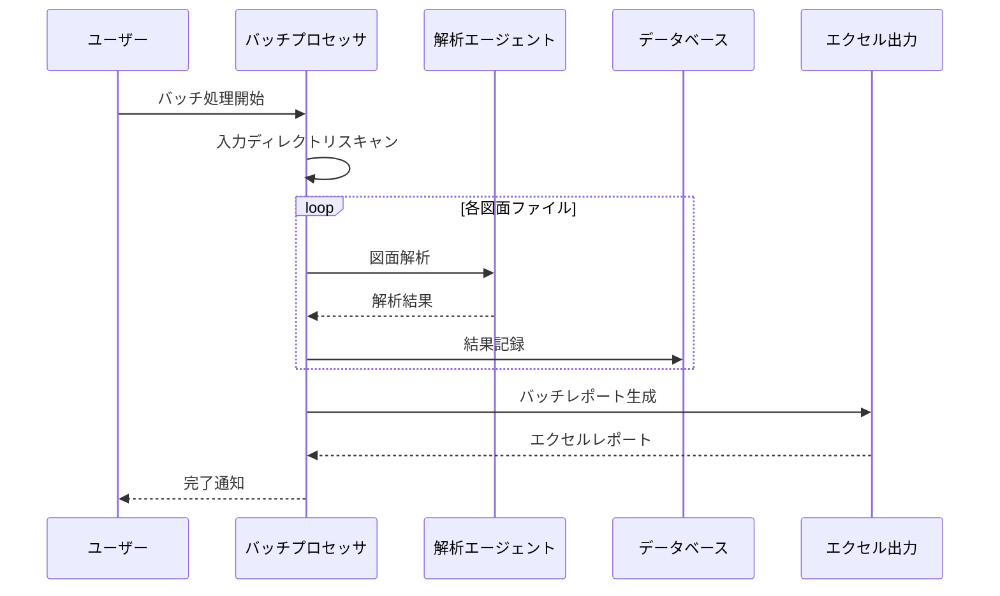

# システムパターン：A4図面解析システム

## システムアーキテクチャ

### 全体構造
A4図面解析システムは、モジュール性と拡張性を重視した階層型アーキテクチャを採用しています。主要なレイヤーは以下の通りです：

```
[UI層] - Streamlitベースのユーザーインターフェース
   ↓
[アプリケーション層] - ビジネスロジックとワークフロー管理
   ↓
[サービス層] - 図面解析、データ処理、エクセル出力などの主要機能
   ↓
[インフラ層] - データベース、ファイルシステム、外部API連携
```

### コンポーネント構成



## 主要設計パターン

### 1. レイヤードアーキテクチャ
システム全体は明確に分離された層で構成され、各層は特定の責務を持ちます。これにより、コードの保守性と拡張性が向上します。

- **UI層**: ユーザーとのインタラクションを担当
- **アプリケーション層**: ビジネスロジックとワークフロー制御
- **サービス層**: 具体的な機能の実装
- **インフラ層**: 外部システムとの連携

### 2. ファサードパターン
複雑なサブシステムに対してシンプルなインターフェースを提供します。`DrawingAnalysisAgent`クラスは、画像処理、AI解析、データベース操作などの複雑な処理を隠蔽し、シンプルなAPIを提供します。

```python
# ファサードの例
agent = DrawingAnalysisAgent(api_key, database_path)
result = agent.analyze_drawing(image_path, request)
```

### 3. ストラテジーパターン
異なる解析戦略を切り替え可能にします。テンプレートを使用した解析と新規解析では異なるアルゴリズムを使用しますが、クライアントコードからは同じインターフェースで利用できます。

```python
# 内部的に異なる戦略を使用
if template:
    results = self._analyze_with_template(image_path, template, request)
else:
    results = self._analyze_without_template(image_path, request)
```

### 4. ファクトリーメソッドパターン
設定に基づいて適切なオブジェクトを生成します。`create_agent_from_config`関数は設定情報からエージェントを生成するファクトリーメソッドです。

```python
def create_agent_from_config(config) -> DrawingAnalysisAgent:
    openai_config = config.get_openai_config()
    database_config = config.get_database_config()
    
    return DrawingAnalysisAgent(
        api_key=openai_config.get('api_key'),
        database_path=database_config.get('path')
    )
```

### 5. オブザーバーパターン
処理の進捗状況を監視し、UIに通知します。バッチ処理では特に重要で、長時間処理の進捗をリアルタイムで表示します。

### 6. テンプレートメソッドパターン
解析プロセスの基本的な流れを定義しつつ、特定のステップをサブクラスでカスタマイズ可能にします。

## データフロー

### 図面解析プロセス


### バッチ処理フロー


## 重要な実装パターン

### 1. A4図面の検出と最適化
A4サイズ（210×297mm）の検出と、非A4図面の自動最適化を行います。

```python
def _check_a4_size(self, width: int, height: int, dpi: int) -> Tuple[bool, float]:
    # DPIの妥当性チェック
    if not self.MIN_DPI <= dpi <= self.MAX_DPI:
        dpi = self.STANDARD_DPI
    
    # 実際のサイズ（mm）
    actual_width_mm = width * 25.4 / dpi
    actual_height_mm = height * 25.4 / dpi
    
    # アスペクト比チェック
    actual_ratio = actual_width_mm / actual_height_mm
    a4_ratio = self.A4_WIDTH_MM / self.A4_HEIGHT_MM
    
    # 縦向きと横向きの両方でチェック
    is_portrait_a4 = (
        abs(actual_width_mm - self.A4_WIDTH_MM) <= self.SIZE_TOLERANCE_MM and
        abs(actual_height_mm - self.A4_HEIGHT_MM) <= self.SIZE_TOLERANCE_MM
    )
    
    is_landscape_a4 = (
        abs(actual_width_mm - self.A4_HEIGHT_MM) <= self.SIZE_TOLERANCE_MM and
        abs(actual_height_mm - self.A4_WIDTH_MM) <= self.SIZE_TOLERANCE_MM
    )
    
    is_valid_a4 = is_portrait_a4 or is_landscape_a4
    
    # スケール係数計算
    if is_portrait_a4:
        scale_factor = self.A4_WIDTH_MM / actual_width_mm
    elif is_landscape_a4:
        scale_factor = self.A4_HEIGHT_MM / actual_width_mm
    else:
        # 近い方のアスペクト比に合わせる
        if abs(portrait_ratio - a4_ratio) < abs(landscape_ratio - a4_ratio):
            scale_factor = self.A4_WIDTH_MM / actual_width_mm
        else:
            scale_factor = self.A4_HEIGHT_MM / actual_width_mm
    
    return is_valid_a4, scale_factor
```

### 2. テンプレートマッチング
類似図面の検出と効率的な処理のためのテンプレートマッチングを実装しています。

```python
def _find_matching_template(self, image_path: str, product_type: Optional[ProductType]) -> Optional[DrawingTemplate]:
    # 画像特徴量を抽出
    features = self.image_processor.extract_layout_features(image_path)
    
    # データベースからテンプレートを検索
    product_type_str = product_type.value if product_type else None
    templates = self.db_manager.get_templates_by_type(product_type_str)
    
    best_match = None
    best_similarity = 0.0
    
    for template_data in templates:
        # テンプレートオブジェクトに変換
        template = DrawingTemplate.from_dict(template_data)
        
        # 類似度計算
        similarity = self._calculate_template_similarity(features, template.layout_features)
        
        if similarity > best_similarity and similarity > 0.75:  # 閾値
            best_similarity = similarity
            best_match = template
    
    return best_match
```

### 3. 画像品質向上処理
図面の認識精度を高めるための画像処理を実装しています。

```python
def _enhance_image(self, image: CVImage) -> CVImage:
    # uint8型に変換
    if image.dtype != np.uint8:
        image = ensure_uint8(image)
    
    # 元画像のコピーを作成
    enhanced = image.copy()
    
    # カラー画像の場合
    if len(image.shape) == 3:
        # YUV色空間に変換してY成分のみを処理
        yuv = cv2.cvtColor(enhanced, cv2.COLOR_BGR2YUV)
        y = yuv[:,:,0]
        
        # 適応的ヒストグラム平坦化
        clahe = cv2.createCLAHE(clipLimit=2.0, tileGridSize=(8, 8))
        y = clahe.apply(y)
        
        # バイラテラルフィルタでノイズ除去（エッジ保持）
        y = cv2.bilateralFilter(y, 9, 75, 75)
        
        # アンシャープマスクでシャープネス強調
        gaussian = cv2.GaussianBlur(y, (0, 0), 3.0)
        y = cv2.addWeighted(y, 1.5, gaussian, -0.5, 0)
        
        # 処理したY成分を戻す
        yuv[:,:,0] = y
        enhanced = cv2.cvtColor(yuv, cv2.COLOR_YUV2BGR)
    
    # ガンマ補正
    gamma = 1.2
    look_up_table = np.empty((1, 256), np.uint8)
    for i in range(256):
        look_up_table[0, i] = np.clip(pow(i / 255.0, 1.0 / gamma) * 255.0, 0, 255)
    enhanced = cv2.LUT(enhanced, look_up_table)
    
    return enhanced
```

### 4. エクセル出力の書式設定
解析結果を見やすいエクセルレポートに変換します。

```python
def _create_results_sheet(self, workbook: openpyxl.Workbook, analysis_result: AnalysisResult):
    ws = workbook.active
    ws.title = "解析結果"
    
    # ヘッダー設定
    headers = ["フィールド名", "抽出値", "信頼度", "位置", "抽出方法", "バリデーション", "備考"]
    
    # ヘッダー行作成
    for col, header in enumerate(headers, 1):
        cell = ws.cell(row=1, column=col, value=header)
        cell.font = Font(bold=True, color="FFFFFF")
        cell.fill = PatternFill(start_color="366092", end_color="366092", fill_type="solid")
        cell.alignment = Alignment(horizontal="center", vertical="center")
    
    # データ行作成
    row = 2
    for field_name, extraction_result in analysis_result.extracted_data.items():
        # フィールド名
        ws.cell(row=row, column=1, value=field_name)
        
        # 抽出値
        value_cell = ws.cell(row=row, column=2, value=str(extraction_result.value))
        
        # 信頼度
        confidence_cell = ws.cell(row=row, column=3, value=extraction_result.confidence)
        confidence_cell.number_format = "0%"
        
        # 信頼度による色分け
        if extraction_result.confidence >= 0.8:
            value_cell.fill = PatternFill(start_color="C6EFCE", end_color="C6EFCE", fill_type="solid")
        elif extraction_result.confidence >= 0.6:
            value_cell.fill = PatternFill(start_color="FFEB9C", end_color="FFEB9C", fill_type="solid")
        else:
            value_cell.fill = PatternFill(start_color="FFC7CE", end_color="FFC7CE", fill_type="solid")
        
        row += 1
```

## エラー処理戦略

### 1. 段階的フォールバック
解析プロセスの各段階で問題が発生した場合、より基本的な方法にフォールバックします。

```python
try:
    # テンプレートを使用した解析
    results = self._analyze_with_template(optimized_path, template, request)
except Exception as e:
    self.logger.error(f"テンプレート解析エラー: {e}")
    # フォールバック: テンプレートなしで解析
    results = self._analyze_without_template(optimized_path, request)
```

### 2. グレースフルデグラデーション
一部の機能が失敗しても、システム全体が停止しないよう設計されています。

```python
def analyze_drawing(self, image_path: str, request: Optional[DrawingAnalysisRequest] = None, **options) -> AnalysisResult:
    try:
        # 通常の解析プロセス
        # ...
    except Exception as e:
        self.logger.error(f"図面解析エラー: {e}")
        # エラー時も基本的な結果を返す
        return AnalysisResult(
            drawing_path=image_path,
            extracted_data={},
            processing_metrics=ProcessingMetrics(processing_time=time.time() - start_time),
            metadata={'error': str(e)}
        )
```

### 3. 包括的なロギング
システム全体で詳細なロギングを実装し、問題の診断と解決を容易にしています。

```python
self.logger = logging.getLogger(__name__)
# ...
self.logger.info(f"図面解析開始: {image_path}")
# ...
self.logger.warning("非A4サイズの図面です。最適化を実行します。")
# ...
self.logger.error(f"図面解析エラー: {e}")
```

## パフォーマンス最適化

### 1. 画像処理の最適化
- 必要な解像度のみ処理（標準300DPI）
- 適応的な画質向上処理
- メモリ効率の良い画像処理

### 2. バッチ処理の並列化
- マルチプロセッシングによる並列処理
- 処理単位の適切な分割
- リソース使用量の監視と制御

### 3. キャッシュ戦略
- テンプレート情報のキャッシング
- 頻繁に使用される画像特徴のメモリキャッシュ
- 解析結果の一時キャッシュ

## セキュリティ考慮事項

### 1. APIキー管理
- 環境変数または設定ファイルでの安全な管理
- アクセス権限の最小化

### 2. データ保護
- 機密図面の安全な取り扱い
- ローカルデータベースの保護
- 一時ファイルの適切な管理と削除

### 3. 入力検証
- アップロードされるファイルの検証
- パラメータの適切なバリデーション
- 不正な入力の検出と拒否
